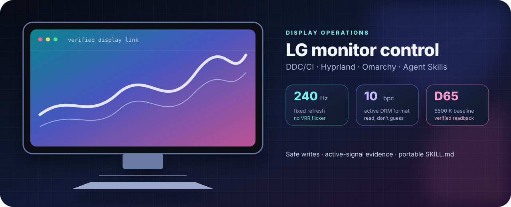
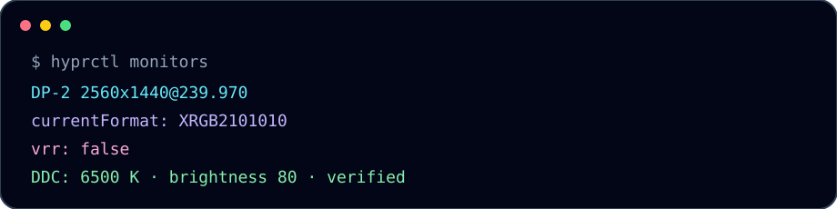

<div align="center">



# LG Monitor Control Skill

**Turn a supported LG monitor into a verified, scriptable Linux display.**

[](https://github.com/shubinlab/lg-skill/actions/workflows/validate.yml)
[](SKILL.md)
[](#compatibility)
[](LICENSE)

</div>

> **Best for:** LG UltraGear/OLED owners who want a clean 240 Hz/10-bit setup, 6500 K color, safe brightness control, VRR-flicker mitigation, and proof that the compositor is really outputting what was requested.

## Why install it?

This skill gives you a display specialist instead of a pile of guessed commands:

- **Know before you touch.** Reads EDID, DDC/CI capabilities, DRM connector limits, active mode, bit depth, and VRR state.
- **Tune the picture in one pass.** Brightness, contrast, 6500 K, RGB gains, sharpness, and model-confirmed Black Stabilizer.
- **Get the high-refresh profile right.** 240 Hz + 10 bpc + fixed refresh when OLED VRR flicker is visible; 144 Hz fallback when the link is marginal.
- **Avoid expensive mistakes.** Snapshots before writes, readback after writes, no random HID/serial payloads, no unsupported 12-bit claims.
- **Omarchy-native.** Writes only user Hyprland overrides and validates with `hyprctl` after every change.
- **Agent-ready.** A compact `SKILL.md` teaches an agent the workflow, safety boundaries, and verification evidence.


## Compatibility at a glance

| Monitor family | Status | What works |
| --- | --- | --- |
| **LG UltraGear/OLED with DDC/CI + MCCS** | Supported | Standard brightness/contrast/color/RGB/sharpness; verified output profiles |
| **LG UltraGear with VCP `0xF9`** | Extended | Black Stabilizer read/write after range validation |
| **LG UltraGear+ OLED 2560×1440/240 Hz** | Reference-tested | 6500 K, brightness, 10 bpc, 240 Hz, fixed-refresh anti-flicker profile |
| **LG displays exposing only basic DDC/CI** | Partial | Standard VCP controls only; vendor OSD controls may be unavailable |
| **LG Monitor Controls USB HID/CDC** | Guarded | Detected and documented; proprietary raw protocol is not fuzzed |
| **Internal laptop panels / no DDC/CI** | Not supported | Use compositor/GPU controls only; no monitor OSD control |

The reference hardware is an LG UltraGear+ OLED EDID profile matching the 27-inch QHD 240 Hz family, commonly identified as **27GS95QE-B**. EDID product IDs are not a guaranteed retail-model identifier; check the physical label before applying model-specific values. Full details: [compatibility matrix](docs/compatibility.md).

## What it can do

- Discover the correct DDC display and connector.
- Snapshot current VCP state before mutations.
- Set and verify brightness, contrast, 6500 K, RGB gains, and sharpness.
- Use confirmed LG UltraGear `0xF9` Black Stabilizer mappings.
- Build a stable Hyprland/Omarchy profile by monitor description.
- Select fixed 240 Hz or 144 Hz fallback modes.
- Verify active `currentFormat`, negotiated bpc, VRR, mode, and link state.
- Explain when an EDID advertises 12 bpc but the active connector exposes only 8–10 bpc.
- Separate SDR, HDR, OLED-care, and VRR concerns instead of mixing them.

## What it cannot promise

- Exact colorimeter-grade calibration without a colorimeter.
- 12-bit output when the physical DP/HDMI path or driver caps the connector at 10 bpc.
- Elimination of OLED VRR flicker while VRR remains enabled.
- A universal raw USB OSD protocol: LG HID/CDC endpoints are proprietary.
- Safe writes to undocumented `0xF7`, `0xF8`, `0x15`, side-channel, or firmware controls without model evidence.
- Control of internal laptop panels that do not expose DDC/CI.

## Quick start

```bash
# 1. Discover the DDC display number.
ddcutil detect

# 2. Read capabilities and current state. Replace 1 with the detected display.
ddcutil --display 1 capabilities
ddcutil --display 1 getvcp 10 12 14 16 18 1A 87
ddcutil --display 1 getvcp f9 --show-unsupported

# 3. Snapshot before changing anything.
ddcutil --display 1 dumpvcp /tmp/lg-monitor-before.vcp

# 4. Verify the compositor and DRM state.
hyprctl monitors all
hyprctl configerrors
modetest -M amdgpu -c
```

For an external monitor where the user reports OLED flicker, use this Omarchy/Hyprland baseline:

```lua
local external = "desc:LG Electronics LG ULTRAGEAR+"
hl.monitor({
  output = external,
  mode = "2560x1440@239.97",
  position = "0x0",
  scale = 1.6,
  bitdepth = 10,
  cm = "srgb",
  vrr = 0,
})
```

Then reload and prove it:

```bash
hyprctl reload
hyprctl configerrors
hyprctl monitors all
```

## Safe picture baseline

| Layer | Baseline | Why |
| --- | --- | --- |
| Resolution | Native panel mode | Avoid scaling blur |
| Refresh | 240 Hz fixed, or 144 Hz fallback | Maximum motion clarity without VRR flicker |
| Output depth | 10 bpc when DRM exposes it | Highest verified depth on many DP paths |
| Color | 6500 K / sRGB for SDR | Neutral white point and sane gamut |
| Contrast | Default, commonly 70 | Avoid crushed highlights |
| RGB gains | 50 / 50 / 50 unless metered | Per-panel calibration values do not transfer |
| Sharpness | 50 | Neutral processing |
| Black Stabilizer | 50 | Avoid lifted blacks and crushed shadows |
| HDR | Off for SDR desktop | Enable only for HDR content |
| OLED Care | Screen Move/Screen Saver on | Reduce static-image risk |

Brightness is room-dependent. A high requested value can be valid for a bright room, but it increases OLED ABL and eye strain; a colorimeter target is more meaningful than a copied percentage.

## Control map

| VCP | Control | Confidence |
| --- | --- | --- |
| `0x10` | Brightness | Standard MCCS |
| `0x12` | Contrast | Standard MCCS |
| `0x14` | Color preset; LG commonly exposes `0x05` as 6500 K | Verified on compatible LG firmware |
| `0x16`, `0x18`, `0x1A` | Red/green/blue gain | Standard MCCS |
| `0x87` | Sharpness | Standard on many LG displays |
| `0xF9` | Black Stabilizer | Verified on compatible UltraGear firmware |
| `0xF7` | Often Response Time | Do not write without model verification |
| `0xF8` | Often FreeSync/Adaptive-Sync | Do not write without model verification |
| `0x15` | Often Picture Mode | Values vary by model and firmware |

Write only after reading the current/max value. Verify every write, then persist with `ddcutil scs`.

## Signal truth, not marketing truth

An EDID can advertise 12 bpc while the current DRM connector only negotiates 8–10 bpc. The active output is the source of truth:

```bash
hyprctl monitors all
modetest -M amdgpu -c
```

If Hyprland reports `XRGB2101010`, the active compositor path is 10-bit. If the connector reports `max bpc: 8..10`, do not claim 12-bit without changing the physical link and rechecking.



## USB: useful, but not a universal OSD API

Some LG UltraGear displays enumerate as `LG Monitor Controls` with HID and CDC ACM interfaces. That can support vendor software and firmware workflows, but no universal public OSD protocol is defined for the raw USB endpoints.

**Do not** send random bytes to `/dev/ttyACM*` or `/dev/hidraw*`. Prefer DDC/CI. If a USB probe fails because of permissions or a tool crash, record the failure instead of guessing at firmware commands.

## Omarchy integration

- User overrides live in `~/.config/hypr/monitors.lua`.
- Never modify `/usr/share/omarchy/`.
- Use description matching when DP connector names renumber.
- After every Lua edit: `hyprctl reload`, `hyprctl configerrors`, `hyprctl monitors all`.
- `hyprsunset` should be identity during color evaluation; a night-light profile changes the perceived white point.

## Troubleshooting

### Flicker with VRR

OLED VRR flicker is commonly most visible in dark scenes and during frame-time changes. Test in this order:

1. Keep 240 Hz and set VRR off.
2. If flicker remains, use 144 Hz with 10 bpc and VRR off.
3. Try a direct DP 1.4 cable instead of a dock/adapter.
4. Recheck `link-status`, `currentFormat`, and kernel DRM messages.

### 12-bit is advertised but unavailable

Check the connector's negotiated `max bpc`. A dock, adapter, DSC path, or driver can cap the active output below the EDID claim. Do not force unsupported values.

### A vendor VCP code returns nonsense

Stop. Read it again, inspect the advertised range, and compare a model-specific mapping. Unknown `F7`, `F8`, `0x15`, side-channel, and firmware controls are not safe to fuzz.

## Install as an agent skill

Copy or link `SKILL.md` into the skill directory used by your agent. The managed version of this skill is intentionally concise and keeps the same safety invariants.

## Evidence and references

- [ddcutil documentation](https://www.ddcutil.com/)
- [LG UltraGear 27GS95QE support](https://www.lg.com/us/support/product/lg-27GS95QE-B.AUS)
- [LG UltraGear VCP reverse-engineering notes](https://github.com/ddccontrol/ddccontrol-db/issues/80)
- [LG monitor DDC/CI controls](https://github.com/tyvsmith/streamcontroller-lg-monitor-control)
- [LG Black Stabilizer documentation](https://www.lg.com/us/support/help-library/lg-monitor-how-to-use-the-black-stablizer-function--20153247885189)

## Contributing

See [CONTRIBUTING.md](CONTRIBUTING.md). Security-sensitive reports belong in [SECURITY.md](SECURITY.md), not a public issue.

## License

MIT. See [LICENSE](LICENSE).
